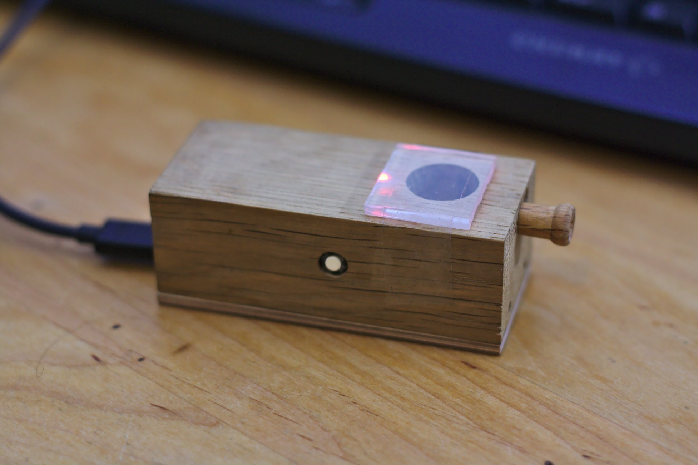
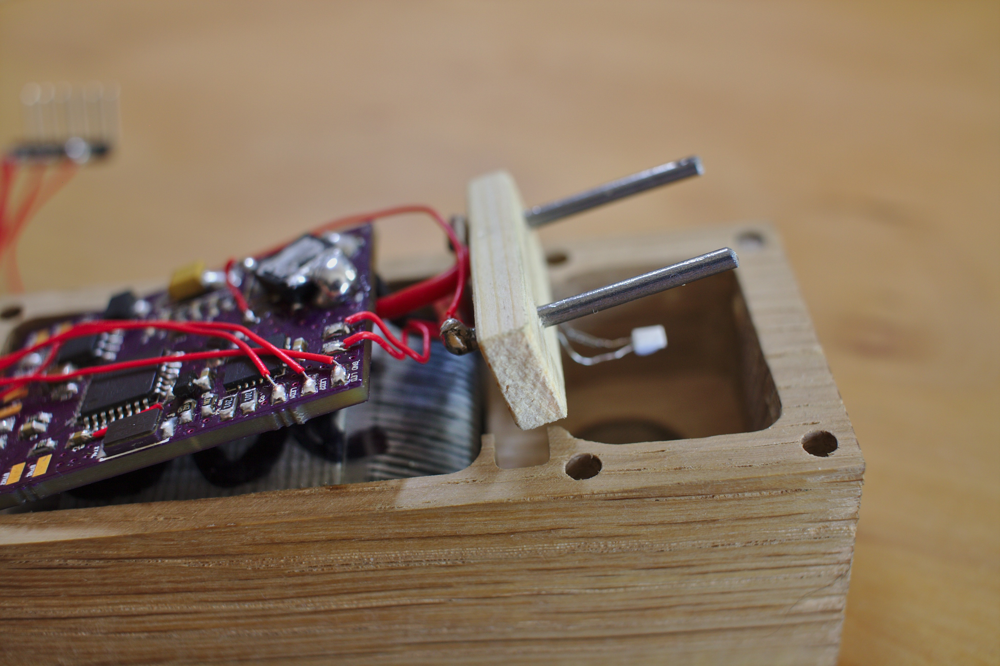
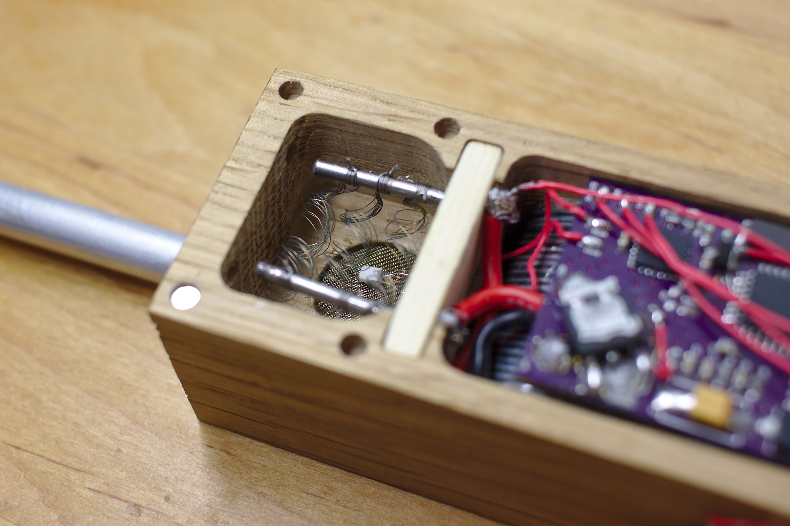

# The Vape - model #

This is the CAD model for the vape.
The CAD itself is modelled using FreeCad.
EstlCAM was used to generate the ngc files.

Schematic can be found at [acidg/vape_hardware](https://github.com/acidg/vape_schematics), firmware is at [acidg/vape_firmawre_arduino](https://github.com/acidg/vape_firmware_arduino).

## Pictures
This project is in early stages, but the first working prototypes do exist:

